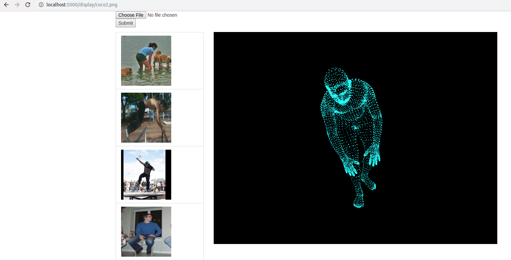

# 3D human body reconstruction from image with SMPL model

This repo provides 3d points view on web given an image. The reconstruction model is based on the [Fork](https://github.com/Dene33/hmr) of [End-to-end Recovery of Human Shape and Pose](https://github.com/akanazawa/hmr). The trained model have to be downloaded seperatedly from:
```
wget https://people.eecs.berkeley.edu/~kanazawa/cachedir/hmr/models.tar.gz && tar -xf models.tar.gz
```

Usage:
- Init virtualenv and install required packages:
```
pip install -r requirements.txt
```
- In case of Tensorflow-gpu, it requires CUDNN and extra export steps (if you also forget it like me):
```
export PATH=$PATH:/usr/local/cuda-10.0/bin/
export LD_LIBRARY_PATH=$LD_LIBRARY_PATH:/usr/local/cuda-10.0/lib64/
```
- Before start server, make sure `./model/` folder is ready, then start:
```
python server.py
```

Todo:
- Enhance 3d view.
- Support export video to bvd.
- Apply real skin from image.
- Enhance shape, apply style transfer.
